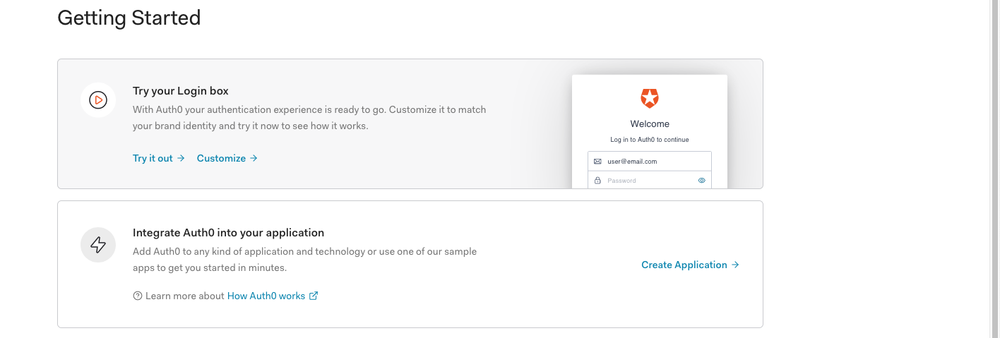
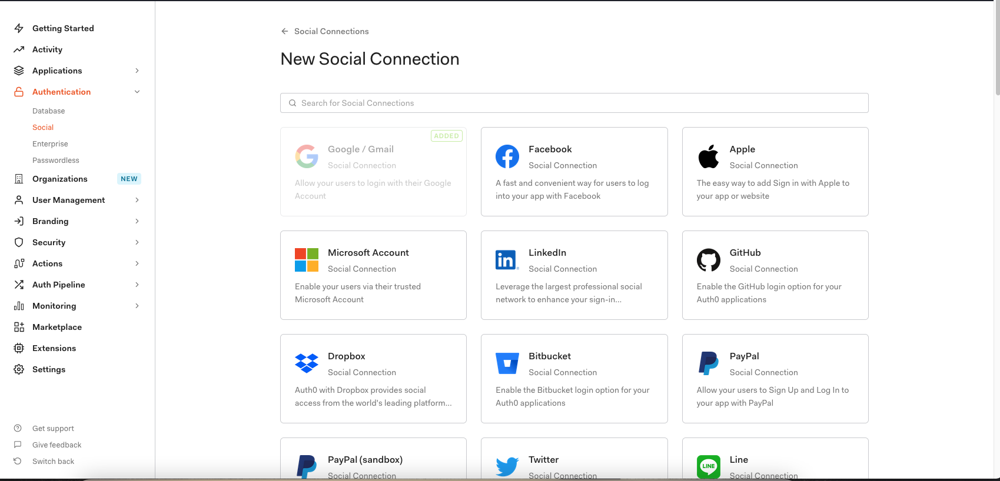
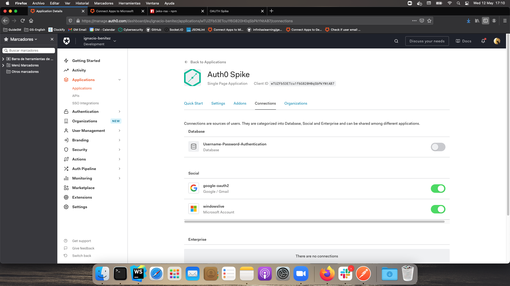
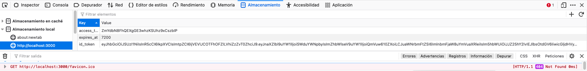
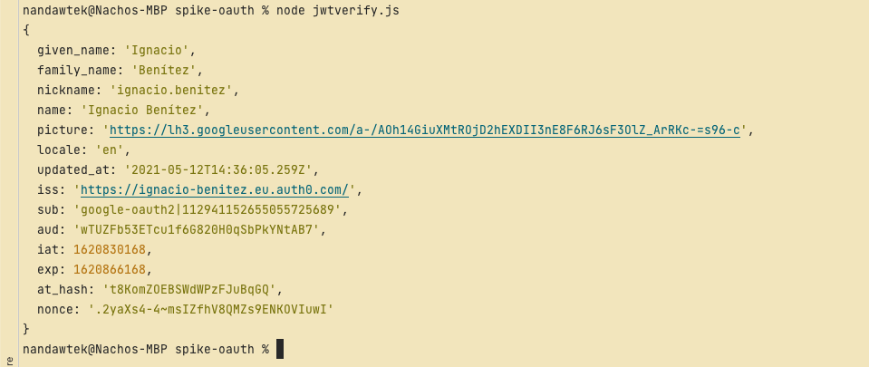

## AUTHenticate your apps

Auth0 is an open source project company that allows you an access to your apps with an authenticated token

- [Company](https://auth0.com/about)

- [Prices](https://auth0.com/about)

### In this spike we have two actions

1. Login. Allows access to secrets file

2. Logout. Disallows access to secret file

You can see our secrets using your guidesmiths or dcsl account or have an unathorized access if you use one gmail account

### How to use Auth0

1. Signup and Login

2. Create an application



3. You can manage it in the applications > aplications menu

It provides you the necessary fields to authenticate your app.
You need to provide a callback and can change the logo and a lot of other things.

5. You can create rules to add your used domains in the menu Auth pipeline section

We enable this rule `Check if user email domain matches configured domain`, and modify to add our tenant domains

```
function checkDomainsAgainstConnectionAliases(user, context, callback) {
  const connectionOptions = context.connectionOptions;
  const domainAliases = connectionOptions.domain_aliases || [];
  const tenantDomainGS = 'guidesmiths.com';
  const tenantDomainDCSL = 'dcsl.com';

  // No domains -> access allowed
  // if (!tenantDomainGS && !domainAliases.length) {
  //  return callback(null, user, context);
  // }

  // Domain aliases exist but no tenant domain exists
  // if (domainAliases.length && !tenantDomainGS) return callback('Access denied');

  const allowedDomains = new Set([tenantDomainGS, tenantDomainDCSL]);
  domainAliases.forEach(function (alias) {
    if (alias) allowedDomains.add(alias.toLowerCase());
  });

  // Access allowed if domain is found
  const emailSplit = user.email.split('@');
  const userEmailDomain = emailSplit[emailSplit.length - 1].toLowerCase();
  if (allowedDomains.has(userEmailDomain)) return callback(null, user, context);

  return callback('Access denied');
}
```

If you click on create rules, you have a lot predefined ones.

6.1 In authentication social, you can add new providers



6.2 In the connection tab of your app you can see the added provider and switch all ones



### Dependencies list

#### Client Side

* [auth0-js](https://www.npmjs.com/package/auth0-js)
* [jwt-decode](https://www.npmjs.com/package/jwt-decode)

#### Server Side

* [jsonwebtoken](https://www.npmjs.com/package/jsonwebtoken)
* [jwks-rsa](https://www.npmjs.com/package/jwks-rsa)

````
"express": "^4.17.1",
"morgan": "^1.10.0"
````

## How this app works

We provide a server, but its for testing purposes, don´t explain that in this code.

### Client

* public/index.html

1. Has the `auth0-js` connection with the date provided in our auth0 app
2. Has the login() call

* secrets.html

1. Has the handleAuthentification method
2. And our secret ;)

* That is my local storage account you can see the id_token, you need it to send it to backend for verify the connection request



### Server

**Helpfull link used with jsonwetoken node library [oauth0-docs](https://auth0.com/docs/tokens/json-web-tokens/validate-json-web-tokens)**

We add a file with the server side verification for learn purposes calls `jwtverify.js`

You can view two tokens:

* Commented one for the WebAuth `scope: openid`
* Used one For the WebAuth `scope: openid profile` with all authenticated user info

With this BACKEND results



